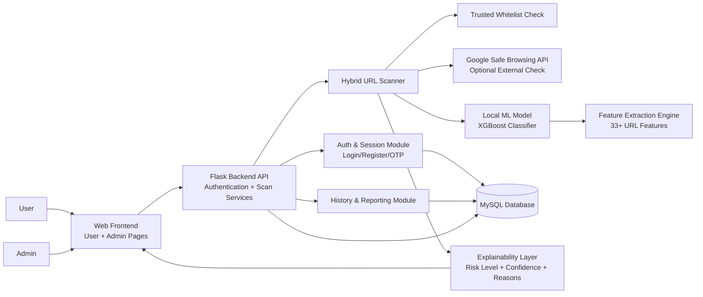

# URL Safety Detection System (URLGuard) - Project Write-up

## Objective
Build an intelligent and user-friendly URL security platform that can detect malicious links in real time, explain why a URL is risky, and support both end users and administrators through a secure role-based dashboard.

## Problem Statement
Phishing and malicious URLs are one of the most common entry points for cyberattacks. Traditional blacklist-only systems fail to detect many new or obfuscated threats, while users often receive no understandable reason behind a warning. Organizations need a practical system that:

- Detects both known and unknown malicious URLs.
- Reduces false alarms for trusted domains.
- Provides explainable results (not just Safe/Malicious labels).
- Supports user management, login monitoring, and security controls.

## DFD / System Architecture Diagram

## Modules
1. **Authentication & Access Control Module**
- Handles admin/user login, registration, OTP verification, session validation, logout, and account status checks.
- Supports role-based routing to user and admin dashboards.

2. **URL Feature Extraction Module**
- Extracts lexical/statistical URL indicators such as entropy, subdomain count, symbol ratios, keyword patterns, and structure anomalies.

3. **Hybrid Detection Module**
- Multi-tier scan pipeline:
  - Tier 1: Trusted whitelist bypass.
  - Tier 2: Google Safe Browsing verification (if enabled).
  - Tier 3: Local ML classification for unknown URLs.

4. **Explainability Module (XAI)**
- Returns interpretable outputs: confidence score, risk class, and important signals influencing the decision.

5. **History & Reporting Module**
- Stores scan outcomes and provides model/report artifacts for analysis (classification summaries, comparison reports, and feature importance outputs).

6. **Admin Management Module**
- Provides user control, security settings, logs, performance views, report pages, and dashboard-level operational visibility.

## Sample Screens
Use the following pages as sample screenshots in the report:

1. **Landing/Login Screen**
- File: `index.html`
- Purpose: Entry point for authentication and system access.

2. **User Scan Screen**
- File: `user/scan.html`
- Purpose: URL submission and safety result display.

3. **User History Screen**
- File: `user/history.html`
- Purpose: Past scan tracking and review.

4. **Admin Dashboard Screen**
- File: `admin/admin.html` (or `admin/scan.html`)
- Purpose: Admin overview and operational controls.

5. **Admin Reports/Performance Screen**
- Files: `admin/reports.html`, `admin/performance.html`, `admin/model.html`
- Purpose: Model performance insights and report visualization.

## Conclusion
The URL Safety Detection System combines secure authentication, hybrid intelligence, and explainable machine learning to provide practical, real-time URL threat analysis. By integrating whitelist checks, optional global threat intelligence, and local ML classification, the system balances speed, detection depth, and usability for both technical and non-technical users.

## Future Enhancements
1. Add real-time browser extension integration for in-page link checks.
2. Introduce continuous model retraining with newly observed phishing patterns.
3. Expand threat intelligence sources beyond Google Safe Browsing.
4. Add multilingual explanation support for broader accessibility.
5. Implement anomaly-based user behavior analytics in the admin panel.
6. Provide API keys and rate-limited public scan endpoints for third-party integration.
7. Add CI/CD-driven security testing, model drift monitoring, and automated rollback policies.
